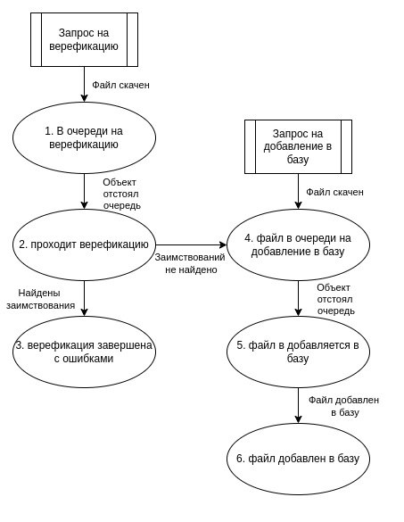

## Инструкция

### Первый запуск

```bash
# Важно перед сборкой или запуском в dev режиме, укажите env зависимости (ссылки на ручки бэкенда) в файле next.config.mjs в env
# Установка зависимостей (библиотек)
npm i
```

ENV зависимости (ссылки на ручки бэкенда) (файл: next.config.mjs)
```js
// Пример
const nextConfig = {
    env: {
        HTTP_VIDEO_DOWNLOAD: process.env.HTTP_VIDEO_DOWNLOAD_NEXT || 'http://caddy:5291/api/videos/download', // адрес пополнения БД без модерации
        WS_VIDEO_DOWNLOAD: process.env.WS_VIDEO_DOWNLOAD_NEXT || 'http://caddy:5291/api/status/currentStatus', // адрес проверки статуса пополнения
        HTTP_VIDEO_MODERATION: process.env.HTTP_VIDEO_MODERATION_NEXT || 'http://caddy:5291/api/videos/verify', // адрес пополнения БД с модерацией
        WS_VIDEO_MODERATION: process.env.WS_VIDEO_MODERATION_NEXT || 'http://caddy:5291/api/status/currentStatus', // адрес проверки статуса модерации
    }
};
```

### Запуск приложения в dev режиме

```bash
# Важно перед сборкой или запуском в dev режиме, укажите env зависимости (ссылки на ручки бэкенда) в файле next.config.mjs в env
# Запуск в dev режиме
npm run dev
```

### Сборка и запуск приложения 

```bash
# Важно перед сборкой или запуском в dev режиме, укажите env зависимости (ссылки на ручки бэкенда) в файле next.config.mjs в env
# Сборка приложения
npm run build
# Запуск сборки
npm run start
```

По умолчанию сайт должен открыться на [http://localhost:3000](http://localhost:3000), однако в случае, если порт занят, то он может занять порт на 1 выше (пример: если порт 3000 занят, то он займёт 3001).

### Форматы данных API

- HTTP_VIDEO_DOWNLOAD (env ключ) - пополнение БД без модерации, post запрос, отправляет объект FormData + в url по ключу title передаёт название видеофайла, принимает обратно id транзакции 
```ts
{id: number}
```
- WS_VIDEO_DOWNLOAD (env ключ) - статус пополнения БД без модерации, post запрос (необходимо в связи с использование ngrok для прототипа, без использования ngrok достаточно get(необходимо переделать на бэкенде)), передаёт через body = { message: 'hello world!' }(не имеет смысла) и в url через ключ fileId ,id транзакции, обратно возвращает статус (videoState) от 1 до 6 (см. картинку 1 ниже)
```ts
{videoState: number}
```


Картинка 1
- HTTP_VIDEO_MODERATION (env ключ) - пополнение БД с модерацией, post запрос, отправляет объект FormData + в url по ключу title передаёт название видеофайла, принимает обратно id транзакции
```ts
{id: number}
```
- WS_VIDEO_MODERATION (env ключ) - статус пополнения БД с модерацией, post запрос (необходимо в связи с использование ngrok для прототипа, без использования ngrok достаточно get(необходимо переделать на бэкенде)), передаёт через body = { message: 'hello world!' }(не имеет смысла) и в url через ключ fileId ,id транзакции, обратно возвращает статус (videoState) от 1 до 6 (см. картинку 1 выше). Также обратно вернётся поле matches, которое стоит читать при статусе 6 или 3
```ts
{
    videoState: number;
    matches: {
        matchTitle: string; // название видеофайла, в котором обнаружено совпадение
        url: string; // ссылка на видеофайл, в котором обнаружено совпадение
        startTime: number; // начало (в секундах) отрезка плагиата, в видеофайле в котором обнаружено совпадение
        endTime: number; // конец (в секундах) отрезка плагиата, в видеофайле в котором обнаружено совпадение
        startTimeMatch: number; // начало (в секундах) отрезка плагиата, в видеофайле отправленного на модерацию
        endTimeMatch: number; // конец (в секундах) отрезка плагиата, в видеофайле отправленного на модерацию
    }[]
}
```
В случае, если массив matches пустой, значит в видеофайле отправленного на модерацию, совпадений не найдено, модерацию он прошёл. Если же в массиве есть хотя бы один элемент, то видеофайл не прошёл модерацию, обнаружены совпадения в других видеофайлах.

### ux

На данном клиенте реализовано 3 страницы.
1. Главная - она является первой страницей, хабом, с которого осуществляется переход на другие разделы.
2. Пополнение базы - страница ,где осуществляется загрузка видеофайла, его отправка, проверка статуса обработки и добавления в базу данных.
3. Модерация - страница ,где осуществляется загрузка видеофайла, его отправка, проверка статуса обработки, ожидание статуса модерации и, в зависимости от результатов, добавление видеофайла в базу данных с уведомлением или возврат отрезков, где обнаружен плагиат, и последующая их демонстрация.
